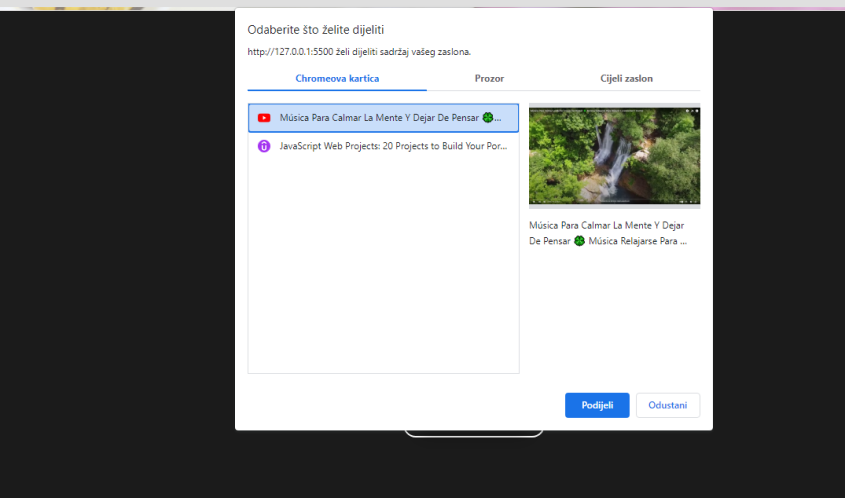
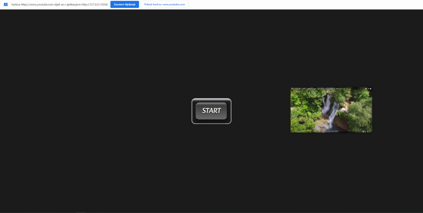
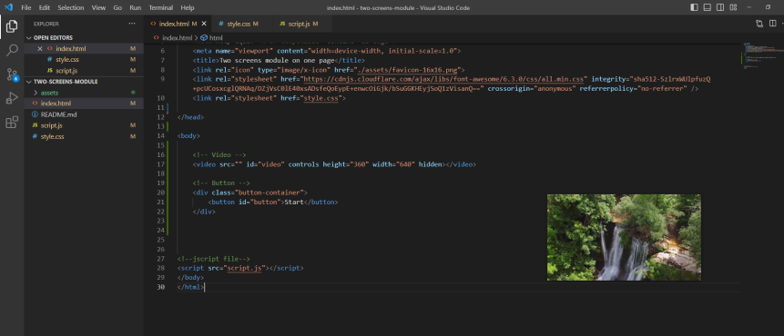

#Picture in picture mode

## Login

To get access to the app's content you need to run it into your browser.

...it will automatical get user prompt window for choosing video  between all opened videos on current navigator(browser).

## Content

After choosing video, user must click on the button to trigger Picture in Picture mode.

...then the video is being displayed in mentioned mode.

...this mode picture can be drag&dropped and it is transfered to all opened browser windows... 

User can enjoy to see it everywhere, while he is working.

# 👉 Built with
* HTML5
* CSS3
* JS

# 💻 Development
1. run index.html on your browser
2. git clone https://github.com/valerijadrinek/two-screen-modules-on-one-page.git

